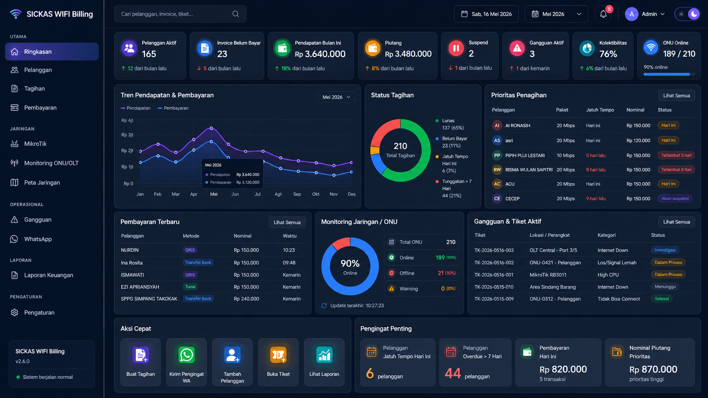

# RTRWNET Management & Billing System



Sistem manajemen ISP berbasis Node.js untuk billing, portal pelanggan, MikroTik, GenieACS, OLT, peta jaringan, inventaris, dan otomatisasi operasional.

## Fitur utama

- Billing pelanggan, invoice, pembayaran manual dan gateway.
- Portal admin, pelanggan, teknisi, agen, dan kolektor.
- Integrasi MikroTik untuk PPPoE, hotspot, voucher, monitoring, usage, FUP, dan isolir.
- Integrasi GenieACS untuk monitoring CPE, ubah SSID/password, dan reboot.
- Monitoring OLT/ONU, peta pelanggan dan ODP, serta laporan operasional.
- Otomatisasi cron untuk tagihan, reminder, isolir, usage sync, dan FUP.

## Stack

- Node.js `>=20`
- Express.js
- SQLite `better-sqlite3`
- EJS
- Leaflet
- MikroTik RouterOS API
- GenieACS API
- SNMP

## Instalasi

```bash
git clone https://github.com/alijayanet/billing-rtrw.git
cd billing-rtrw
npm install
```

## Konfigurasi

Repo ini memakai dua lapis konfigurasi:

- `settings.json`
  Template aman yang boleh ikut source code.
- `settings.local.json`
  Konfigurasi operasional privat. File ini diabaikan oleh git dan dipakai untuk menyimpan secret asli.

Langkah awal:

```bash
copy settings.json settings.local.json
```

Lalu isi `settings.local.json` dengan:

- `genieacs_url`, `genieacs_username`, `genieacs_password`
- `mikrotik_host`, `mikrotik_user`, `mikrotik_password`, `mikrotik_port`
- `session_secret`
- `admin_username`, `admin_password`, `admin_api_key`
- kredensial gateway pembayaran, WhatsApp, Telegram, atau TR-069 bila dipakai

Catatan:

- Jangan simpan secret nyata di `settings.json`.
- Perubahan dari halaman pengaturan admin akan disimpan ke `settings.local.json`.
- Untuk produksi, pastikan semua password, token, dan `session_secret` diganti dengan nilai kuat.

## Menjalankan aplikasi

```bash
npm start
```

Mode pengembangan:

```bash
npm run dev
```

Entry point aplikasi:

```bash
app-customer.js
```

## PM2

```bash
npm install pm2 -g
pm2 start app-customer.js --name billing-rtrw
```

## Akses portal

Port mengikuti `server_port` di konfigurasi aktif, default `3001`.

- Beranda: `http://[IP-SERVER]:3001/`
- Pelanggan: `http://[IP-SERVER]:3001/customer/login`
- Admin: `http://[IP-SERVER]:3001/admin/login`
- Teknisi: `http://[IP-SERVER]:3001/tech/login`
- Agen: `http://[IP-SERVER]:3001/agent/login`
- Kolektor: `http://[IP-SERVER]:3001/collector/login`
- Health: `http://[IP-SERVER]:3001/health`

## QA

```bash
npm run qa
```

Perintah ini menjalankan:

- syntax check
- render EJS smoke test
- smoke core
- static scan

## Audit publish

Sebelum membagikan source:

```bash
npm run audit:publish
```

Audit ini memeriksa:

- file deploy internal yang tidak boleh ikut repo
- file konfigurasi privat yang tidak boleh ter-track
- `settings.json` yang masih berisi secret nyata

Checklist lengkap ada di [PUBLIC_RELEASE_CHECKLIST.md](PUBLIC_RELEASE_CHECKLIST.md).

## Catatan keamanan

- Jangan commit `settings.local.json`, database produksi, auth session WhatsApp, log, atau backup runtime.
- Gunakan `npm run audit:publish` sebelum push atau membuat paket rilis.
- Jika ingin membagikan source sebagai zip, buat paket dari tracked files yang sudah lolos audit, bukan dari seluruh folder kerja lokal.

## Lisensi

ISC. Lihat file `LICENSE`.
